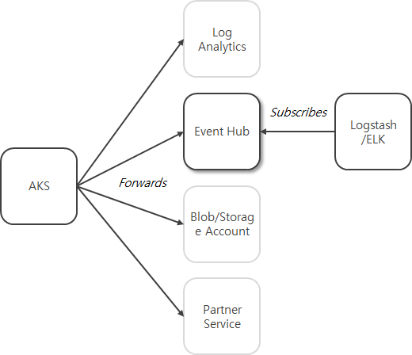

# AKS Log Export
This is an example shows how to integrate and export AKS control plane logs to ELK/Logstash

## Description

Configuration looks like this, with AKS, it provides control plane logs of kubernetes and native integrations for the logs with options. In this example, it shows how to achieve log integrations, AKS -> Event Hub -> Logstash/ELK out of the options



For the partner service integration, please find details from [here](https://docs.microsoft.com/en-us/azure/partner-solutions/overview)

See further details from these two documents

**Enable and review Kubernetes control plane logs in Azure Kubernetes Service (AKS)**
https://docs.microsoft.com/en-us/azure/aks/view-control-plane-logs

**Azure Event Hubs plugin**
https://www.elastic.co/guide/en/logstash/current/plugins-inputs-azure_event_hubs.html#_event_hub_connection_string

With latest version of Logstash `7.13.1`, you don't need to install plugins separately

## Briefly how to

1. [Config Event Hub Namespace and instance](https://docs.microsoft.com/en-us/azure/event-hubs/event-hubs-create)
2. [Adding Diagnostic Setting of AKS](https://docs.microsoft.com/en-us/azure/aks/view-control-plane-logs)
  1. Add kubernetes logs from log & metric
  2. Add Destination with Event Hub Namespace and instance
  3. Save changes
3. Deploy a pod for test 
4. [Configure Logstash/ELK](#logstash-configuration)
5. [Test by running Logstash](#running-logstash)

### Logstash Configuration

Save this at your host where with your Event Hub access over network as for example `eh-pipeline.conf`

```javascript
input {
   azure_event_hubs {
      event_hub_connections => ["<Connection String of your Event Hub instance>"]
      threads => 8
      decorate_events => true
      consumer_group => ""<Consumer Group in your Event Hub instance>""
      storage_connection => "<Connection String of your Storage Account>"
   }
}

output {
  stdout {
    id => "kube-audit"
  }
}
```
You can find all arguments for  `event_hub_connections`, `consumer_group`, `storage_connection`, from your Event Hub instance in the portal

### Running Logstash

From your command line

```command
${LS_HOME}/bin/logstash -f eh-pipeline.conf
```

Once you've installed Logstash alone by using package installer, you need to give write permission to `${LS_HOME}/data` for current user to run 